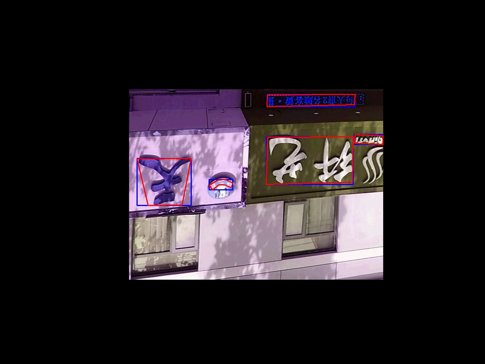

# Preprocess module

the module is a fixed version for text detection on mmdetetion tools

## requirments(py3)
- shapely
- mmcv
- numpy
- cv2
- PIL

and maybe pycocotools

## Usage
all codes are write in numpy arrays, taking some special situation into account

till now, the code can do basic **Data Augmentation** for images with **box** and **segmentation** annotations in data_type numpy.arrays, so this can be easyly expanded to all deeplearning frameworks.

- [x] Random_rotate(random rotate with box and segmentations) 
- [x] Distortion(random change with brightness, contrast, saturation and hue)
- [x] Expand(random padding images in corlor (r,g,b))
- [x] **Random_crop**(random crop with box and segmentations) 
- [ ] Scale
- [ ] Normalization

the code should work well on datasets with bbox and segmentation annotations, here is an example in ctw1500,
all the annotations in this datasets has 14 points for segmentations, but the code should work well despite of the numbers of the points

basic uses seen from the test examples in [main.py]( https://github.com/jichilen/image_processing_python_tools/blob/203667d0d2a8722433039f66db903d36efc2be70/image_preprocess/main.py#L12)

## Examples
### some examples for polygon mask version
<table>
  <tr>
    <td></td>
    <td></td>
  </tr>
  <tr>
    <td></td>
    <td></td>
  </tr>
  <tr>
    <td></td>
    <td></td>
  </tr>
  <tr>
    <td></td>
    <td></td>
  </tr>
  <tr>
    <td></td>
    <td></td>
  </tr>
</table>

### some examples for image mask version
<table>
  <tr>
    <td></td>
    <td></td>
  </tr>
  <tr>
    <td></td>
    <td></td>
  </tr>
  <tr>
    <td></td>
    <td></td>
  </tr>
  <tr>
    <td></td>
    <td></td>
  </tr>
  <tr>
    <td></td>
    <td></td>
  </tr>
</table>
