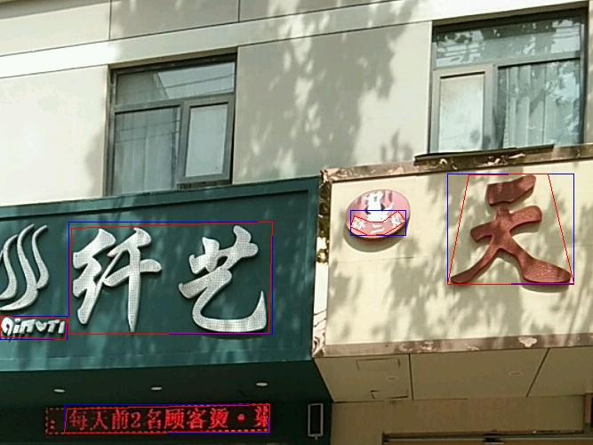
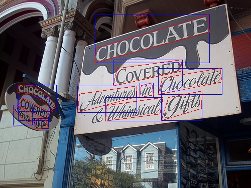

# Preprocess module

the module is a fixed version for text detection on mmdetetion tools

## requirments(py3)
- shapely
- mmcv
- numpy
- cv2
- PIL

and maybe pycocotools

## Usage
all codes are write in numpy arrays, taking some special situation into account

the code should work well on datasets with bbox and segmentation annotations, here is an example in ctw1500,
all the annotations in this datasets has 14 points for segmentations, but the code should work well despite of the numbers of the points

basic uses seen from the test examples in Preprocesser.py

## Examples

